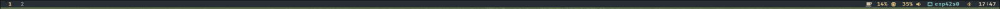
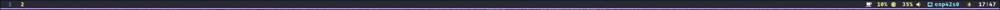

# Configuration previews

## WM/DE

### Plasma (Recommended)

KDE Plasma is a powerful and feature-rich desktop environment that uses the KWin compositor to deliver a highly customizable interface. It provides a traditional desktop metaphor while offering advanced modularity and extensive tools for both casual and professional users.

### Jay

Jay is a modern, tiling Wayland compositor written in Rust that emphasizes performance and high configurability. It is designed to provide a fast and efficient workflow for users who prefer a lightweight, keyboard-driven environment.

### Niri

Niri is a unique tiling compositor for Wayland that organizes windows into an "infinite ribbon" layout. Instead of shrinking windows to fit the screen, it allows you to scroll through them horizontally, offering a very distinct and fluid user experience.

## SDDM

### Minecraft

[Original link](https://github.com/Davi-S/sddm-theme-minesddm)

### Minimal

[Original link](https://github.com/stepanzubkov/where-is-my-sddm-theme)

### Jake the dog

[Original link](https://github.com/Keyitdev/sddm-astronaut-theme)

### Sakura

[Original link](https://github.com/Keyitdev/sddm-astronaut-theme)

### Japanese Aesthetic

[Original link](https://github.com/Keyitdev/sddm-astronaut-theme)

## Waybar

### Everforest

### Dracula

